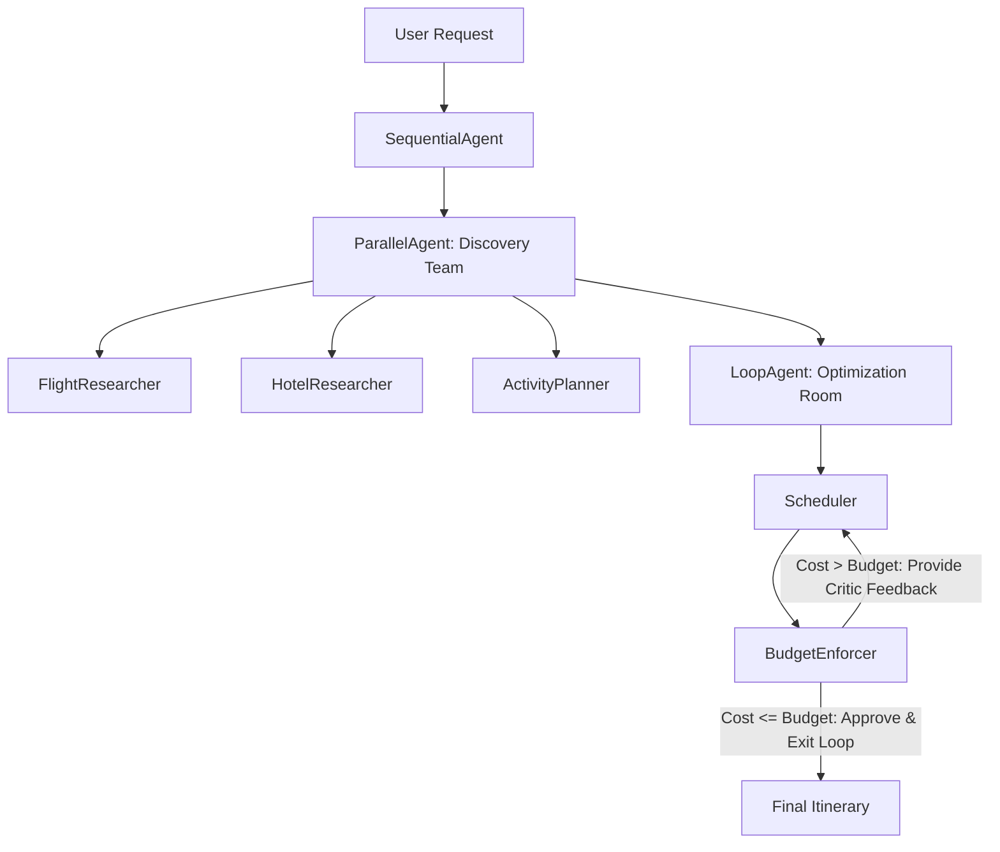

# Travel Itinerary Builder

Autonomous Multi-Agent AI Vacation Planning Pipeline built with **Google ADK**, **Gemini API**, and a **Flask** frontend.

---

## 🏛️ Architecture Overview

The system implements a **Sequential Pipeline** coordinating a **Parallel Discovery Phase** followed by an iterative **Loop Refinement Phase**:



### 1. Parallel Discovery Team (`ParallelAgent`)
- **FlightResearcher**: Locates transport options, flight/train times, and costs.
- **HotelResearcher**: Finds lodging options across luxury, mid-range, and budget tiers matching safety and user interests.
- **ActivityPlanner**: Compiles and structures landmarks, dining, and multi-day activities and tours.

### 2. Loop Optimization Room (`LoopAgent`)
- **Scheduler**: Utilizes the **Gemini Skills Integration** (`itinerary-enhancer-skill`) to construct engaging, themed day-by-day schedules with strict **geographic clustering** (grouping daily activities within the same neighborhood to minimize transit waste). Synthesizes discovery data, calculates total costs, and adapts to `critic_feedback` during iterative refinement.
- **BudgetEnforcer**: Compares total costs against the user's budget.
  - If `cost <= budget`: sets `budget_approved = true` and exits the loop.
  - If `cost > budget`: sets `budget_approved = false`, generates specific `critic_feedback`, and triggers the next iteration (capped at 5 iterations).

---

## 📋 Global State Schema

All agents interact with a single centralized dictionary state conforming to:

```json
{
  "user_input": {
    "destination": "Kyoto, Japan",
    "budget": 2000.0,
    "days": 5,
    "interests": ["Historic Culture", "Food & Dining"]
  },
  "raw_research": {
    "flights": [],
    "hotels": [],
    "activities": []
  },
  "current_itinerary": {
    "total_estimated_cost": 1850.0,
    "schedule": [
      {
        "day": 1,
        "events": [
          {
            "time": "09:00 AM",
            "title": "Morning Landmark Walk",
            "category": "culture",
            "estimated_cost": 0.0,
            "description": "Explore historical temples and streets."
          }
        ]
      }
    ]
  },
  "critic_feedback": "Budget approved: Total cost is within budget.",
  "budget_approved": true
}
```

---

## 🚀 Getting Started

### 1. Environment Setup
Create a `.env` file in the project root (or copy from `.env.example`):

```bash
cp .env.example .env
```

Add your Gemini API key and desired model:
```env
GEMINI_API_KEY=your_gemini_api_key_here
GEMINI_MODEL=gemini-3.5-flash-lite
FLASK_ENV=development
PORT=5000
```

### 2. Install Dependencies
```bash
pip install -r requirements.txt
```

### 3. Run the Flask Web Application
```bash
python app.py
```
Open your browser at `http://localhost:5000`.

---

## 🧪 Running Tests

Run the complete test suite verifying structural integrity, context extraction, and graceful failure handling:

```bash
python -m unittest discover -s tests -p "test_*.py"
```

---

## 📜 Event Logging
All pipeline lifecycle events, model requests/responses, tool calls, and execution snapshots are automatically recorded into:
- [`artifacts/events.json`](file:///home/pi-net/Documents/agent_eng_labs/agent_engineering/my-apps/travel-Itinerary-builder/artifacts/events.json)

---

## 🌟 Student Assignment Milestones Verified

- **Structural Integrity (30%)**: Explicitly declared `ParallelAgent` and `LoopAgent` frameworks in `pipeline/agents.py`.
- **Context Extraction & State Management (40%)**: The `Scheduler` extracts `critic_feedback` from prior iterations to adapt choices and meet budget constraints.
- **Graceful Failure Handling (30%)**: Handles impossible budgets and edge cases gracefully without crashing, returning structured actionable itineraries and advisory feedback.
